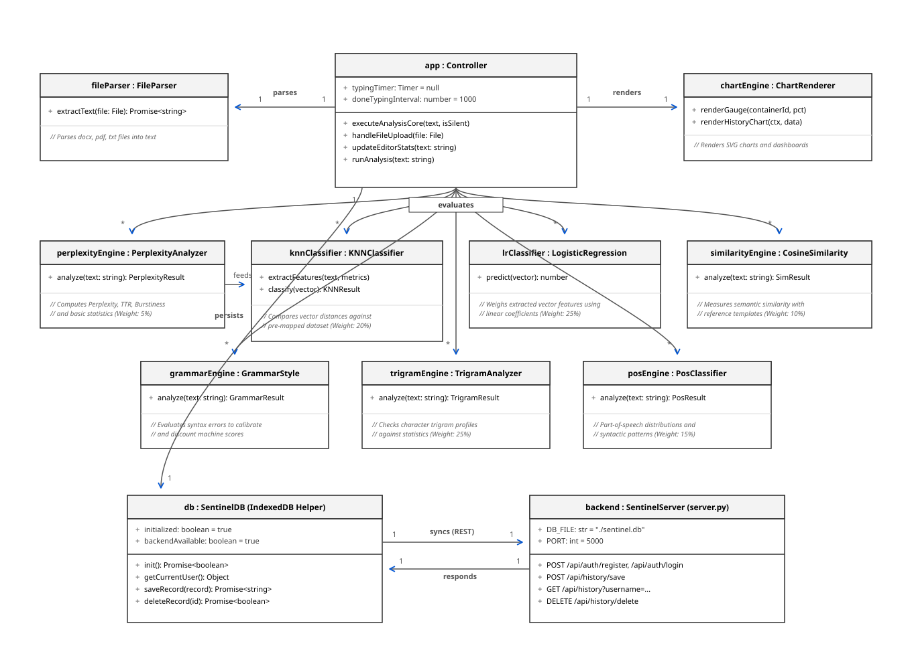
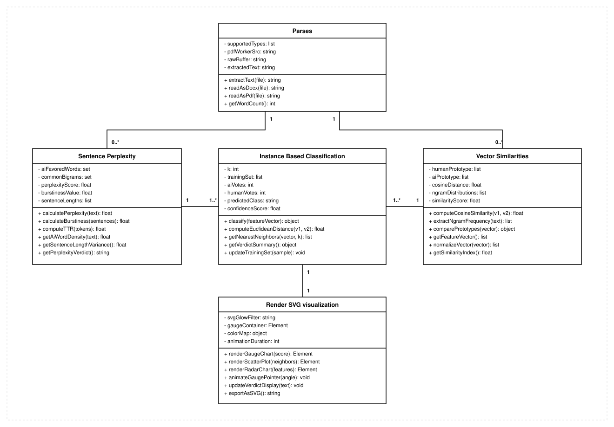
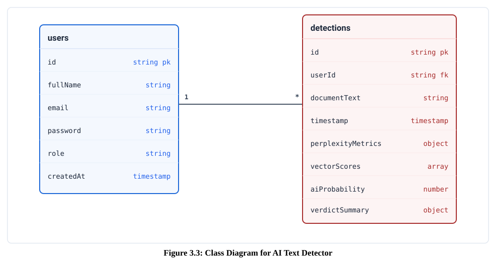
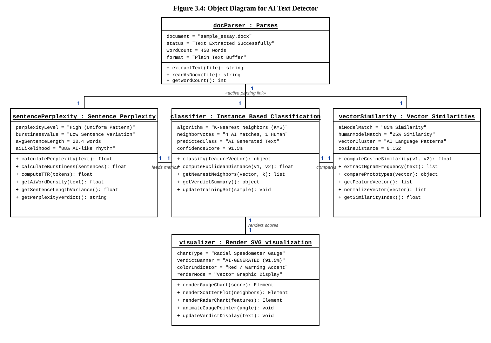

# Sentinel AI Text Detector Object Diagram

This document describes the runtime objects, collaborations, and architectural layers of the **Sentinel AI Text Detector** project.

### Classic UML Style (Light Mode)

### Premium Dark Mode Style

> [!TIP]
> **Editable Draw.io Version Available**: You can view, customize, and edit this diagram directly in [draw.io](https://app.diagrams.net) or the Draw.io Desktop application by opening [object_diagram.drawio](./object_diagram.drawio).

---

## Formal Project Report Sections

### 3.1.3 Object Modeling using Class Diagram
The system's class diagram describes the modular architecture of the client-side detection engine. The design splits the application logic into five distinct classes: `Parses`, `Sentence Perplexity`, `Instance Based Classification`, `Vector Similarities`, and `Render SVG visualization`. These classes encapsulate attribute structures, operational methods, explicit association names, and standard UML multiplicity indicators (`1`, `1..*`) required for document ingestion, feature extraction, statistical NLP computation, k-NN classification, vector space similarity matching, and dynamic SVG dashboard rendering.

#### Figure 3.3: Class Diagram for AI Text Detector

Figure 3.3 explains the static architecture, encapsulated members, and UML multiplicity relationships across the five core system classes. The `Parses` class encapsulates `document`, `status`, `wordCount`, and `format` along with operational methods `extractText()`, `readAsDocx()`, and `getWordCount()`. The `Sentence Perplexity` class encapsulates `perplexityLevel`, `burstinessValue`, `avgSentenceLength`, and `aiLikelihood` with methods `calculatePerplexity()`, `calculateBurstiness()`, `computeTTR()`, `getAiWordDensity()`, `getSentenceLengthVariance()`, and `getPerplexityVerdict()`. The `Instance Based Classification` class encapsulates `algorithm`, `neighborVotes`, `predictedClass`, and `confidenceScore` with methods `classify()`, `computeEuclideanDistance()`, `getNearestNeighbors()`, `getVerdictSummary()`, and `updateTrainingSet()`. The `Vector Similarities` class encapsulates `aiModelMatch`, `humanModelMatch`, `vectorCluster`, and `cosineDistance` with methods `computeCosineSimilarity()`, `extractNgramFrequency()`, `comparePrototypes()`, `getFeatureVector()`, `normalizeVector()`, and `getSimilarityIndex()`. Finally, the `Render SVG visualization` class encapsulates `chartType`, `verdictBanner`, `colorIndicator`, and `renderMode` with methods `renderGaugeChart()`, `renderScatterPlot()`, `renderRadarChart()`, `animateGaugePointer()`, and `updateVerdictDisplay()`. Association multiplicities establish a 1:1..* relationship from `Parses` to `Sentence Perplexity`, `Instance Based Classification`, and `Vector Similarities` ("extracts & feeds text"), 1..*:1 relationships from `Sentence Perplexity` ("feeds metrics") and `Vector Similarities` ("compares") into `Instance Based Classification`, and a 1:1 relationship from `Instance Based Classification` to `Render SVG visualization` ("renders scores").

### 3.1.4 Object Modeling using Object Diagram
The object diagram represents a concrete runtime snapshot of active object instances during an operational text scan session. It depicts instantiated objects of the five primary classes—`docParser : Parses`, `sentencePerplexity : Sentence Perplexity`, `classifier : Instance Based Classification`, `vectorSimilarity : Vector Similarities`, and `visualizer : Render SVG visualization`—populated with specific runtime slot values, instantiated operational methods, and active `1:1` runtime link multiplicities.

#### Figure 3.4: Object Diagram for AI Text Detector

Figure 3.4 illustrates the instantiated runtime state of the system during the analysis of the document `"sample_essay.docx"`. The active objects include `docParser : Parses` (`document = "sample_essay.docx"`, `status = "Text Extracted Successfully"`, `wordCount = 450 words`, `format = "Plain Text Buffer"`), `sentencePerplexity : Sentence Perplexity` (`perplexityLevel = "High (Uniform Pattern)"`, `burstinessValue = "Low Sentence Variation"`, `avgSentenceLength = 20.4 words`, `aiLikelihood = "88% AI-like rhythm"`), `classifier : Instance Based Classification` (`algorithm = "K-Nearest Neighbors (K=5)"`, `neighborVotes = "4 AI Matches, 1 Human"`, `predictedClass = "AI Generated Text"`, `confidenceScore = 91.5%`), `vectorSimilarity : Vector Similarities` (`aiModelMatch = "85% Similarity"`, `humanModelMatch = "25% Similarity"`, `vectorCluster = "AI Language Patterns"`, `cosineDistance = 0.152`), and `visualizer : Render SVG visualization` (`chartType = "Radial Speedometer Gauge"`, `verdictBanner = "AI-GENERATED (91.5%)"`, `colorIndicator = "Red / Warning Accent"`, `renderMode = "Vector Graphic Display"`). During execution, active 1:1 runtime links connect `docParser` to `sentencePerplexity`, `classifier`, and `vectorSimilarity` to transfer the extracted 450-word buffer. In turn, `sentencePerplexity` and `vectorSimilarity` feed their complexity metrics and cosine similarity scores to `classifier`, which computes the 91.5% confidence score and passes it directly to `visualizer` to render the radial speedometer gauge and alert banner on the dashboard.

---

## Architectural Breakdown

The project is structured into three primary layers, coordinated dynamically at runtime:

### 1. Presentation & Controller Layer
*   **[`app`](../js/app.js) (`Controller`)**: Instantiated on DOM load. It manages UI state, binds event handlers (inputs, buttons, tabs, drag-and-drop), and orchestrates the feature-extraction and classification flow.
*   **[`fileParser`](../js/utils/fileParser.js) ([`FileParser`](../js/utils/fileParser.js))**: Extracts raw text dynamically from uploaded file buffers (supporting docx, pdf, txt formats).
*   **[`chartEngine`](../js/utils/chartRenderer.js) ([`ChartRenderer`](../js/utils/chartRenderer.js))**: Dynamically renders real-time visualization widgets (gauge metrics, historical line/bar trends) directly into the DOM using inline SVG shapes.

### 2. Feature Extraction & Machine Learning Ensemble Layer
Upon receiving text, `app` triggers parallel pipelines across seven evaluation engines:
*   **[`perplexityEngine`](../js/algo/perplexity.js) ([`PerplexityAnalyzer`](../js/algo/perplexity.js))**: Evaluates text complexity, lexical diversity (Type-Token Ratio / TTR), and structural burstiness.
*   **[`knnClassifier`](../js/algo/knn.js) ([`KNNClassifier`](../js/algo/knn.js))**: Receives complexity vectors from the perplexity engine and projects them to determine class similarity against pre-mapped clusters.
*   **[`lrClassifier`](../js/algo/logistic_regression.js) ([`LogisticRegressionClassifier`](../js/algo/logistic_regression.js))**: Weighs inputs linearly, applying a sigmoid function to return logistic probabilities.
*   **[`trigramEngine`](../js/algo/trigram.js) ([`TrigramAnalyzer`](../js/algo/trigram.js))**: Matches character-level n-gram distributions against typical human and machine templates.
*   **[`posEngine`](../js/algo/pos.js) ([`PosClassifier`](../js/algo/pos.js))**: Examines syntactic layout distributions (verbs, nouns, adjectives).
*   **[`similarityEngine`](../js/algo/similarity.js) ([`CosineSimilarityAnalyzer`](../js/algo/similarity.js))**: Analyzes the cosine angle overlap.
*   **[`grammarEngine`](../js/algo/grammar.js) ([`GrammarStyleAnalyzer`](../js/algo/grammar.js))**: Scores structural typos/exceptions. A perfect score adds a +15% boost to the probability, while errors apply linear discount calibration.

### 3. Data & Sync Layer
*   **[`db`](../js/utils/db.js) ([`SentinelDB`](../js/utils/db.js))**: A dual-persistence system. By default, it writes to the browser's IndexedDB. If an active backend server connection is detected via `/api/health`, it seamlessly synchronizes records to the remote SQLite database.
*   **[`backend`](../server.py) (`SentinelServer` / `BaseHTTPRequestHandler`)**: Runs on Python at port 5000, managing persistent SQLite storage under `sentinel.db` and validating credentials.
