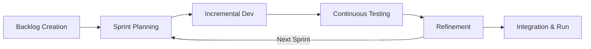

# Web Application Vulnerability Scanner
**A Project Report**  
*Submitted in partial fulfillment of the requirements for the degree of Bachelor in Computer Applications (BCA)*

**Submitted by:** Shashank Singh (6-2-410-140-2021)  
**Supervisor:** Ms. Rolisha Sthapit  
**Institution:** Faculty of Humanities and Social Sciences, Tribhuvan University / Prime College  
**Date:** June, 2026 A.D.

---

## ABSTRACT

Modern web applications are under constant threat. Because they manage everything from sensitive credentials to financial data, websites represent high-value targets for malicious actors. Vulnerabilities like SQL Injection, Cross-Site Scripting (XSS), and missing HTTP security headers act as dangerous security entry points. Left unaddressed, they expose database records and lead to severe financial or reputational damage. 

This project introduces an automated, client-side Web Application Vulnerability Scanner designed to uncover these common security gaps. The system crawls a target URL, identifies input forms, and tests fields using custom payloads. By analyzing server responses, status codes, and pattern anomalies, the scanner flags active vulnerabilities. It also integrates an OWASP-based risk assessment system that rates findings as Low, Medium, or High based on exploitability and impact. Built with React for the interactive dashboard and Python/Flask for the backend scanning engine, this tool provides developers with a local, lightweight method to audit their applications prior to deployment.

**Keywords:** Web Security, Vulnerability Scanner, SQL Injection, Cross-Site Scripting (XSS), Open Redirect, OWASP Risk Assessment

---

## TABLE OF CONTENTS
1. [CHAPTER 1: INTRODUCTION](#chapter-1-introduction)
2. [CHAPTER 2: BACKGROUND STUDY AND LITERATURE REVIEW](#chapter-2-background-study-and-literature-review)
3. [CHAPTER 3: SYSTEM ANALYSIS AND DESIGN](#chapter-3-system-analysis-and-design)
4. [CHAPTER 4: IMPLEMENTATION AND TESTING](#chapter-4-implementation-and-testing)
5. [CHAPTER 5: CONCLUSION AND FUTURE RECOMMENDATIONS](#chapter-5-conclusion-and-future-recommendations)

---

## CHAPTER 1: INTRODUCTION

### 1.1 Introduction
Web applications form the core infrastructure of modern digital services. From banking systems and retail portals to healthcare applications, academic databases, and government networks, web interfaces handle massive amounts of sensitive data daily. 

However, this widespread reliance has made web applications prime targets for cyberattacks. A minor security flaw in an application's input handling can trigger severe consequences, exposing user databases and causing substantial financial losses. 

While manual penetration testing is highly thorough, it is also time-consuming, expensive, and prone to human oversight. Automated security scanners are therefore essential for continuous testing. 

This project addresses these challenges by developing a full-stack **Web Application Vulnerability Scanner**. The scanner crawls target sites, maps active input fields, and injects test payloads to detect vulnerabilities like SQL Injection, XSS, and Open Redirects. It aggregates results into a visual dashboard built on React, backed by a Flask backend and MongoDB database, offering developers an accessible way to secure their code early in the development lifecycle.

### 1.2 Problem Statement
Securing contemporary web applications is difficult. Organizations across all sectors use web interfaces that are continuously exposed to common vulnerabilities. Key problems addressed by this project include:
*   **Widespread Vulnerability Exposure:** SQL Injection, XSS, and misconfigured HTTP headers remain prevalent security issues.
*   **High Risk of Compromise:** Exploiting these gaps allows attackers to bypass authentication, leak databases, and compromise client sessions.
*   **Inefficient Manual Audits:** Manual security testing is slow, expensive, and requires scarce cybersecurity expertise.
*   **Need for Developer-Centric Tools:** Developers need a simple, lightweight tool to audit code locally during development without relying on complex, enterprise-grade software.

### 1.3 Objectives
The primary objectives of this project are:
*   **Automate Web Security Testing:** Design a scanner to automatically identify standard vulnerabilities in web systems.
*   **Build Targeted Detection Modules:** Write specific injection engines to test for SQL Injection (SQLi), Cross-Site Scripting (XSS), Open Redirects, and security header misconfigurations.
*   **Implement OWASP Severity Rating:** Grade identified vulnerabilities using a standardized risk score based on exploitability and impact.
*   **Develop an Intuitive Dashboard:** Create a frontend interface for starting scans, monitoring real-time streaming progress, and reviewing reports.
*   **Store Historical Audits:** Maintain a database backend to track previous scan reports for auditing over time.

### 1.4 Development Methodology
This project utilized the Agile software development model. Because vulnerability patterns and project requirements can change, an iterative approach was necessary to develop and test individual scanner modules progressively. 



The cycle was divided into focused phases:
*   **Backlog & Sprint Planning:** Project requirements—such as crawling, SQLi testing, and reporting—were broken down into tasks.
*   **Incremental Development:** Code was written in cycles. Early sprints established the React frontend and Flask server, while later sprints focused on specific detection modules.
*   **Continuous Testing:** Each module was validated against local, vulnerable test applications to verify detection accuracy.
*   **Final Integration:** After completing the crawler and vulnerability modules, they were linked to the database and dashboard to form the final system.

### 1.5 Report Organization
This project report is organized into five chapters:
*   **Chapter 1 (Introduction):** Introduces the project background, problem statement, key objectives, and development methodology.
*   **Chapter 2 (Background Study & Literature Review):** Reviews security standards and compares existing scanners with this project.
*   **Chapter 3 (System Analysis & Design):** Details requirements, feasibility, database schemas, and UML models.
*   **Chapter 4 (Implementation & Testing):** Describes development tools, module logic, and includes unit testing test cases.
*   **Chapter 5 (Conclusion & Recommendations):** Summarizes findings and suggests improvements for future iterations.

---

## CHAPTER 2: BACKGROUND STUDY AND LITERATURE REVIEW

### 2.1 Background Study
As digital services migrate to cloud environments, web applications have become central to commerce, education, finance, and public administration. This transition, however, has widened the attack surface. Cybercriminals actively seek software weaknesses to bypass security controls and access backend databases.

Historically, organizations relied on manual security testing (penetration testing) performed by external experts. Although highly effective at uncovering complex logical flaws, manual audits are expensive, slow, and hard to scale. Consequently, automated vulnerability scanners have become essential. 

Standard security scanners like Burp Suite or OWASP ZAP offer powerful capabilities but often present steep learning curves for novice developers. Building lightweight, custom scanner dashboards using modern frameworks like React and Flask allows development teams to incorporate security checks directly into their daily workflows.

### 2.2 Literature Review
Several researchers have explored the design and efficacy of automated scanning tools:

*   **Erturk (2017) [2]:** Discussed the deployment of automated vulnerability scanners in educational settings. The study examined Acunetix and its internal modules, AcuSensor and AcuMonitor, demonstrating how automated scanners speed up vulnerability detection and provide actionable remediation advice to developers.
*   **Ge (2006) [3]:** Investigated the integration of security mechanisms into Agile software lifecycles. The author emphasized that waiting until the deployment phase to run security tests is highly inefficient. Incorporating automated testing during active sprints reduces the cost of patching security vulnerabilities.
*   **Sajjad Rafique (2002) [4]:** Evaluated the role of intrusion detection systems (IDS) and secure design practices in reducing application-level security threats. The research highlighted that input validation rules implemented during the early coding stages act as a critical shield against database exploits.
*   **Domínguez-García et al. (2023) [5]:** Conducted a systematic mapping of testing techniques against the STRIDE threat model. The study classified 18 software testing techniques and 88 tools, comparing traditional penetration testing with modern, AI-assisted security tools.
*   **Nawrocki (2024) [6]:** Explored trends in web exploits and evaluated layered defense strategies guided by the OWASP framework. The author simulated attacks against test applications, demonstrating that combining automated testing with secure development practices significantly decreases vulnerability rates.
*   **Rafique et al. (2015) [7]:** Compiled an empirical map of vulnerability detection approaches from 1994 to 2014. The authors classified detection methods against the standard software development lifecycle and the OWASP Top 10 vulnerabilities, providing a foundation for modern scanner designs.

---

## CHAPTER 3: SYSTEM ANALYSIS AND DESIGN

### 3.1 System Analysis

#### 3.1.1 Requirement Analysis

##### Functional Requirements
The system supports three user roles: anonymous visitors, registered users, and administrators.
*   **User Registration & Login:** Users must be able to sign up and authenticate using secure credentials.
*   **Profile Management:** Registered users can update their email, username, and password.
*   **Target URL Registration:** Users specify the URL of the target web application they wish to scan.
*   **Vulnerability Scanning:** The backend engine crawls the target site, identifies forms, runs tests, and detects security flaws.
*   **Real-Time Progress Tracking:** The frontend must stream active scan updates to the user using Server-Sent Events (SSE).
*   **Report Generation:** The system compiles completed scans into structured reports detailing severity levels and recommended patches.
*   **Scan History Logs:** Users can access a dashboard containing previous reports.
*   **User Management (Admin):** Administrators can manage registered accounts, edit permissions, or suspend users.
*   **System Activity Monitor (Admin):** Admins can review server logs and scan execution histories globally.

##### Non-Functional Requirements
*   **Usability:** The interface must remain clean and intuitive, requiring no advanced cybersecurity training to operate.
*   **Security:** Password storage must use strong hashing (bcrypt), and APIs must be protected via JSON Web Tokens (JWT).
*   **Performance:** Scans must run asynchronously in background threads to avoid blocking user interactions.
*   **Accuracy:** Detection rules must be tuned to minimize false positives and false negatives.
*   **Scalability:** The architecture must support concurrent scan sessions without performance degradation.
*   **Availability:** The scanning engine should remain accessible for local or remote audits.

#### 3.1.2 Feasibility Analysis
*   **Technical Feasibility:** The scanner utilizes lightweight Python libraries (`requests`, `sockets`, `threading`) and standard database tools (`MongoDB`), making it highly compatible with standard developer environments.
*   **Operational Feasibility:** The clean React dashboard simplifies scan initiation, progress tracking, and report retrieval, making it usable for developers and system administrators.
*   **Economic Feasibility:** Built entirely on open-source technologies (React, Flask, MongoDB), the project avoids license fees and incurs minimal infrastructure costs.
*   **Schedule Feasibility:** The project was planned across a 52-day timeline, distributing tasks between design, backend implementation, testing, and documentation.

#### 3.1.3 Object Modeling (Class Diagram)
The database structure is built around two primary entities: **User** and **Scan**. A User document stores authentication data, profile details, and account creation timestamps. A Scan document records the target URL, completion status, raw vulnerability lists, overall risk score, and a severity summary. Each scan references a parent `userId`, forming a one-to-many relationship.

#### 3.1.4 Dynamic Modeling (State & Sequence Diagrams)
*   **State Machine:** The scanning pipeline moves through defined states:
    $$\text{Idle} \rightarrow \text{Validation} \rightarrow \text{Initializing} \rightarrow \text{Scanning} \rightarrow \text{Analysis/Filtering} \rightarrow \text{Reporting}$$
*   **Sequence Flow:** The frontend client sends a scan request to the Flask server. The server verifies the target URL, triggers the scanning engine asynchronously, streams real-time progress via SSE, stores results in MongoDB, and returns the final report payload to the client.

#### 3.1.5 Process Modeling (Activity Diagram)
The scanner execution flow is as follows:
1.  User enters target URL.
2.  Input validation parses the URL scheme and host.
3.  The engine crawls the target page to extract links and forms.
4.  Scanning modules run tests concurrently (port scanner, header check, SQLi/XSS tests).
5.  Identified issues are filtered, scored, and logged.
6.  The dashboard updates to show the final report.

### 3.2 System Design

#### 3.2.1 Component Diagram
The system follows a three-tier architecture:
*   **Presentation Layer (React):** Manages user interaction, routes paths, displays reports, and handles state via Zustand and React Query.
*   **Application Layer (Flask):** Exposes REST API endpoints, handles authentication, runs background thread pools, and manages crawling and injection.
*   **Data Layer (MongoDB):** Persists user credentials, scan history, and system logs.

#### 3.2.2 Deployment Diagram
For local environments, the React frontend runs on port 5173, communicating with the Flask backend on port 5000 via REST requests. MongoDB operates as a service on port 27017.

---

### 3.3 Algorithm Details

#### 3.3.1 Web Application Vulnerability Scanning Algorithm (Core System)
The core coordinator initializes scan configurations and runs checking modules sequentially or concurrently:
```python
def orchestrate_scan(target_url):
    results = []
    # Initialize connection and verify host status
    if not ping_host(target_url):
        return error_result("Host unreachable")
    
    # Run passive checks
    results.extend(check_security_headers(target_url))
    results.extend(validate_ssl_certificate(target_url))
    
    # Run active checks
    forms = crawl_target(target_url)
    results.extend(test_sql_injection(forms))
    results.extend(test_cross_site_scripting(forms))
    
    return results
```

#### 3.3.2 Rule-Based Detection Algorithm
This engine evaluates static server properties. It inspects response headers for security controls like `Content-Security-Policy` and `Strict-Transport-Security`, checks cookie configurations, and flags missing attributes.

#### 3.3.3 Payload Injection Algorithm
Tests input fields by inserting crafted strings and observing server responses.
*   **SQL Injection Payload:** `' OR '1'='1`
*   **XSS Payload:** `<script>alert('xss')</script>`
The module monitors response times and returns HTML strings to determine if user inputs are parsed as code.

#### 3.3.4 Signature-Based Detection Algorithm
Compares server error strings and response text against a database of known signatures, such as database error messages (e.g., `"You have an error in your SQL syntax"`) or server framework footprints.

#### 3.3.5 Response Analysis Algorithm
Measures discrepancies in HTTP status codes, redirection behaviors, and response lengths between normal requests and modified payloads.

#### 3.3.6 Port Scanning Algorithm (Socket-Based)
Creates raw socket connections to commonly used service ports (21, 22, 80, 443, 3306, 8080) to detect open services and assess the target host's attack surface.

#### 3.3.7 Severity Scoring Algorithm
Calculates the final application risk rating by weighting discovered vulnerabilities:
$$\text{Risk Score} = (40 \times \text{Critical}) + (20 \times \text{High}) + (10 \times \text{Medium}) + (5 \times \text{Low})$$

#### 3.3.8 Technology Fingerprinting Algorithm
Examines headers like `Server` and `X-Powered-By` along with specific HTML script tags to identify backend frameworks (e.g., Django, Laravel) and server software (e.g., Apache, Nginx).

#### 3.3.9 Directory Brute Force / Enumeration Algorithm
Sends HTTP requests to paths from a built-in dictionary (e.g., `/admin`, `/.env`, `/.git`, `/backup`) and monitors status codes:
*   `200 OK` indicates exposed resources.
*   `403 Forbidden` indicates directory listing restrictions.

#### 3.3.10 Cookie Security Validation Algorithm
Checks cookies set in HTTP responses for the `Secure`, `HttpOnly`, and `SameSite` flags to verify session protection.

---

## CHAPTER 4: IMPLEMENTATION AND TESTING

### 4.1 Implementation

#### 4.1.1 Tools Used
*   **Flask:** Lightweight Python framework used to build REST APIs and manage request routing.
*   **Flask-CORS:** Manages cross-origin resource sharing configuration between the backend and React dashboard.
*   **PyMongo:** Python driver used to connect with and query MongoDB databases.
*   **PyJWT:** Used to issue and validate secure JSON Web Tokens for user authentication.
*   **React (Vite + TypeScript):** Used to construct the components for the UI dashboard.
*   **Zustand:** Light state-management library used to track active scan updates and login states globally.

#### 4.1.2 Implementation Details of Modules

##### HTTP Security Header Analyzer
Sends an HTTP request to the target site, retrieves the headers collection, and verifies the configuration of crucial security controls:
```python
def check_headers(url):
    vulnerabilities = []
    required = ["Strict-Transport-Security", "Content-Security-Policy", "X-Frame-Options", "X-Content-Type-Options"]
    try:
        response = requests.head(url, timeout=5)
        for header in required:
            if header not in response.headers:
                vulnerabilities.append({
                    "type": "Missing Security Header",
                    "header": header,
                    "severity": "Medium"
                })
    except requests.RequestException as e:
        vulnerabilities.append({"type": "Connection Error", "error": str(e), "severity": "Info"})
    return vulnerabilities
```

##### Directory Enumerator
Iterates through a list of paths and verifies server accessibility status:
```python
def brute_force_directories(url):
    discovered = []
    paths = ["/admin", "/.env", "/.git", "/backup", "/phpmyadmin"]
    for path in paths:
        target = f"{url.rstrip('/')}{path}"
        try:
            res = requests.get(target, timeout=3)
            if res.status_code == 200:
                discovered.append({
                    "path": path,
                    "status": "Exposed",
                    "severity": "Critical" if path in ["/.env", "/.git"] else "High"
                })
        except requests.RequestException:
            continue
    return discovered
```

##### SQL Injection Checker
Appends SQL syntax modifiers to URL parameters and checks responses for database errors:
```python
def scan_sqli(url, params):
    payload = "' OR '1'='1"
    vulnerable = False
    for param in params:
        test_params = params.copy()
        test_params[param] = payload
        try:
            res = requests.get(url, params=test_params, timeout=5)
            # Check for database error signatures
            if any(err in res.text.lower() for err in ["sql syntax", "mysql_fetch", "postgre", "driver"]):
                vulnerable = True
                break
        except requests.RequestException:
            pass
    return vulnerable
```

---

### 4.2 Testing

#### 4.2.1 Unit Testing Results

##### API Endpoints Testing
The following tests validated the REST API endpoints exposed by the Flask backend:

| S.N | Test Objective | Test Input | Expected Outcome | Actual Outcome | Status |
|---|---|---|---|---|---|
| 1 | Start Application | `http://127.0.0.1:5000/` | Server runs successfully | Server running | Pass |
| 2 | Register with Empty Data | Empty fields | Validation error message | Validation error returned | Pass |
| 3 | Create Valid Account | Unique email, password | Account created successfully | Account registered | Pass |
| 4 | Duplicate Registration | Existing email address | Error: "User already exists" | Error message returned | Pass |
| 5 | Login without Password | Email address only | Parameter validation error | Validation error returned | Pass |
| 6 | Authenticate User | Correct email and password | JWT token returned | JWT token returned | Pass |
| 7 | Login with Bad Password | Wrong password | Error: "Invalid credentials" | Error returned | Pass |
| 8 | Access Scan History | Authenticated GET request | Previous scan list | List of scans displayed | Pass |
| 9 | Request Unauthorized Scan | Scan request without token | 401 Unauthorized response | 401 Unauthorized | Pass |

##### Vulnerability Scanner Modules Testing
The following tests validated the detection capabilities of the scanner modules:

| S.N | Target Test Module | Test Input / Environment | Expected Outcome | Actual Outcome | Status |
|---|---|---|---|---|---|
| 1 | Header Check | Target missing security headers | Missing headers identified | Missing headers listed | Pass |
| 2 | SSL Validation | HTTPS target | Certificates details retrieved | SSL data gathered | Pass |
| 3 | Port Scanner | Open HTTP and MySQL ports | Ports 80 and 3306 open | Open ports mapped | Pass |
| 4 | Tech Detection | Standard Apache/React site | Web server and React detected | Apache & React listed | Pass |
| 5 | Directory Search | Exposed `/.env` file | Path identified as Critical risk | `/.env` flagged as Critical | Pass |
| 6 | SQLi Detection | Parameter vulnerable to SQLi | SQL Injection vulnerability found | Vulnerability logged | Pass |
| 7 | XSS Detection | Parameter echoing payload | Reflected XSS vulnerability found | Vulnerability logged | Pass |
| 8 | CORS Policy Check | Wildcard Origin allowed | Misconfiguration detected | CORS weakness flagged | Pass |
| 9 | Cookie Checks | Missing Secure/HttpOnly flags | Insecure cookies detected | Cookie weaknesses flagged | Pass |

---

## CHAPTER 5: CONCLUSION AND FUTURE RECOMMENDATIONS

### 5.1 Conclusion
The **Web Application Vulnerability Scanner** project demonstrates the implementation of automated, client-side security analysis. By integrating multiple checks—such as port scanning, directory traversal, header validation, and input injections—the tool allows developers to identify potential security gaps before deployment. 

The modular system architecture uses React for the interactive UI, Python/Flask for API handling, and MongoDB for secure data persistence. SSE support enhances usability by streaming scan progress in real time. 

The system successfully achieves its primary goals: identifying security flaws, generating risk scores based on OWASP severity standards, maintaining historical records, and producing structured reports.

### 5.2 Future Recommendations
*   **Integrate Advanced Attack Modules:** Add detection logic for CSRF vulnerabilities, command injections, and XML external entity (XXE) vulnerabilities.
*   **Deploy AI-Based Scanning:** Implement machine learning algorithms to prioritize threats and classify zero-day exploits.
*   **Continuous Threat Alerts:** Extend the application into a daemon service that periodically crawls target sites and sends email alerts.
*   **Distributed Scanning:** Improve scanning performance by implementing multi-threaded worker pools to handle multiple endpoints concurrently.
*   **Containerization & Cloud Deployment:** Package the full stack using Docker to facilitate deployment on cloud instances.

---

## REFERENCES

1. Gray, S. (2020). *What is the Agile Methodology in Software Development*. Medium. https://serenagray2451.medium.com/what-is-the-agile-methodology-in-software-development-c93023a7eb85
2. Erturk, E. (2017). * Deployment of Automated Vulnerability Scanners*. Harvard / arXiv. https://ui.adsabs.harvard.edu/abs/2017arXiv170608017E/abstract
3. Ge, X. (2006). *Agile Development of Secure Web Applications*. SCIRP. https://www.scirp.org/reference/referencespapers?referenceid=1565154
4. Rafique, S. (2002). *Secure Software and Intrusion Detection Systems*. RTO/NATO Real-Time Intrusion Detection Symposium. https://www.scirp.org/reference/referencespapers?referenceid=1565156
5. Domínguez-García, A. J. (2023). *Security Testing for Web Applications*. IEEE Xplore. https://ieeexplore.ieee.org/document/10568290
6. Nawrocki, M. (2024). *Vulnerabilities of Web Applications: Good Practices and New Trends*. ACIG.
7. Rafique, S., Humayun, M., Hamid, B., & Abbas, A. (2015). *Web application security vulnerabilities detection approaches*. IEEE Xplore. https://ieeexplore.ieee.org/document/7176244
